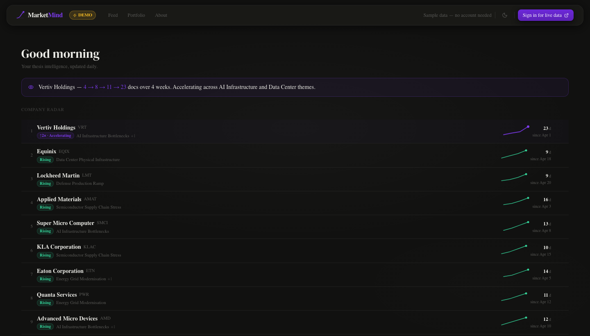
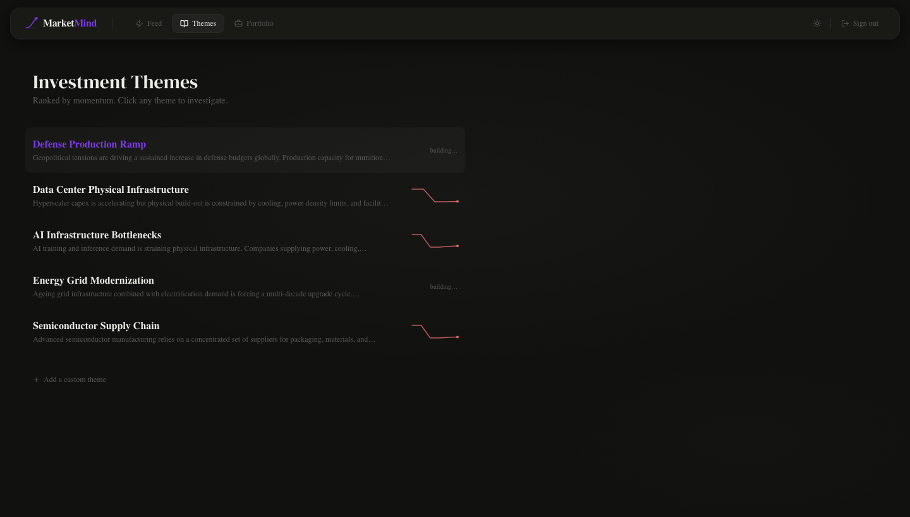
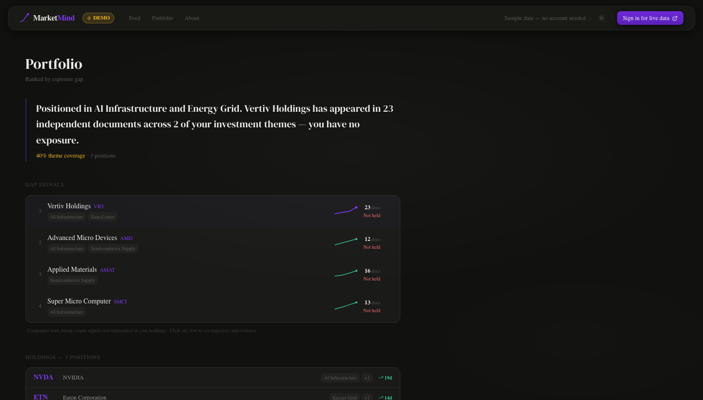
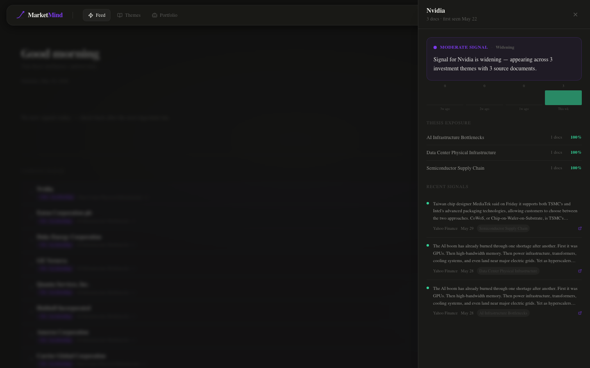

# MarketMind

A persistent investment intelligence platform that tracks how companies and theses evolve across SEC filings and financial news — running entirely on local infrastructure.

**[Live Demo →](http://localhost:3001/demo)**

---

## Overview

Most investment research tools answer a question you already know to ask. You search for a company; you get results. You ask an AI; it synthesizes what it was trained on. The problem is that the most valuable signals often don't arrive as a single decisive event — they accumulate gradually, across many documents, over weeks or months.

MarketMind is built around a different model. It reads SEC filings and financial news every day, scores each document against a set of tracked investment theses, and builds a persistent corpus over time. The longer it runs, the more meaningful each new signal becomes — because you can see it in context of everything that came before.

This is not a stock screener. It does not produce buy/sell recommendations. It tracks the trajectory of companies and themes through a growing body of evidence, and surfaces that trajectory in plain English each morning.

---

## Why I Built It

Investment research has a memory problem.

Search engines return results ranked by relevance today, with no concept of how interest in a company has changed over the past six weeks. AI assistants synthesize knowledge from training data, with no awareness of what's been published since. Most tools are designed to answer point-in-time queries, not to accumulate evidence and surface trends as they develop.

The signals I care about most don't announce themselves. A small defense contractor mentioned in three analyst reports in January might appear in eight SEC filings in February and fourteen news articles in March — before anyone calls it a trend. That trajectory is only visible if something is watching continuously, storing the evidence, and tracking the count over time.

I wanted a system that does that automatically: reads the sources I care about, maintains a persistent record, and tells me each morning what changed — without me having to ask.

---

## Example Signal

Assume you're tracking a thesis around power grid infrastructure investment. A company called Powell Industries appears once in a utility analyst's 8-K filing in early March. Unremarkable.

By mid-April, it has appeared in four additional SEC filings from companies in adjacent sectors, all referencing electrical distribution as a supply chain dependency. By May, it appears in nineteen documents across your tracked corpus — analyst commentary, procurement filings, industry RSS feeds.

No single document is the signal. The trajectory is the signal.

MarketMind tracks this automatically. Powell Industries surfaces in the Company Radar ranked by unique source document count, with a four-week activity sparkline showing the acceleration. The portfolio gap detector flags it if you don't hold a position. The company panel shows which theses it's appearing in, what the supporting/opposing evidence split looks like, and when it was first seen.

A one-time LLM query on March 5th would have returned nothing meaningful. The corpus had to accumulate first.

---

## Key Features

**Daily Intelligence Briefing**
Each morning, a unified narrative synthesizes what changed across all tracked theses — which are gaining strength, which are weakening, and what the key cross-theme signals are. Generated via SSE streaming from a local LLM, pre-warmed after each ingestion run so it's ready immediately on first open.

**Thesis Tracking**
Five pre-seeded investment theses (AI Infrastructure, Semiconductor Supply Chain, Energy Grid, Defense, Data Center Physical), each with configurable keywords and a running confidence score. Confidence is calculated as `supporting / total_evidence_count` with a 90-day half-life decay applied to older evidence — so stale signals fade rather than accumulate indefinitely. Ranked by weekly momentum (7-day confidence delta) so the fastest-moving theses surface first.

**Company Trajectory Analysis**
The Company Radar ranks companies by unique source document count, with a four-week activity sparkline and week-over-week growth signals. Accelerating companies — those where this week's activity is at least 2× last week's — are sorted to the top. The company deep-dive panel shows the signal strength verdict, trajectory chart, thesis exposure breakdown, and recent evidence.

**Portfolio Gap Detection**
Connect your holdings and MarketMind identifies companies that appear frequently in the corpus across multiple theses — but that you don't currently hold. Gap urgency is ranked by `doc_count × thesis_count × recency_weight`, so recently-active, multi-thesis companies surface above stale signals from large-cap noise.

**Long-Term Corpus Memory**
Every scored document is stored permanently. Evidence records are immutable — re-evaluation is always an explicit user action, never automatic. The corpus accumulates across ingestion runs; a document ingested in January contributes (with decay) to confidence calculations in June. The value compounds over time.

**Evidence-Backed Investigation**
Every thesis confidence score links back to the specific evidence records that produced it. The company panel shows the excerpt, source, sentiment classification, and originating thesis for each signal. Nothing is a black box.

---

## System Architecture

```
┌─────────────────────────────────────────────────────────────┐
│  Next.js 15 Frontend (App Router, React 19, Tailwind CSS)  │
│  Feed · Themes · Portfolio · Company Panel                  │
└────────────────────────┬────────────────────────────────────┘
                         │ HTTP / SSE
┌────────────────────────▼────────────────────────────────────┐
│  FastAPI Backend (Python 3.12, async SQLAlchemy)            │
│  Thesis scoring · Portfolio alignment · Feed generation     │
└──────┬──────────────────┬──────────────────┬───────────────┘
       │                  │                  │
┌──────▼──────┐  ┌────────▼───────┐  ┌──────▼──────┐
│  PostgreSQL │  │     Qdrant     │  │    Redis    │
│  Theses     │  │  Document      │  │  Feed cache │
│  Evidence   │  │  embeddings    │  │  Ingestion  │
│  Snapshots  │  │  (semantic     │  │  checkpoints│
│  Holdings   │  │   search)      │  └─────────────┘
└─────────────┘  └────────────────┘
                         │
┌────────────────────────▼────────────────────────────────────┐
│  Ingestion Pipeline (daily scheduler, Docker container)     │
│  SEC EDGAR · Yahoo Finance · RSS feeds · 60 curated tickers │
└────────────────────────┬────────────────────────────────────┘
                         │
┌────────────────────────▼────────────────────────────────────┐
│  Ollama (local LLM server)                                  │
│  qwen3:8b — sentiment classification, narrative generation  │
│  nomic-embed-text — document embeddings                     │
└─────────────────────────────────────────────────────────────┘
```

**Frontend** — Next.js 15 with the App Router. Three primary surfaces: Feed (daily briefing), Themes (thesis list and detail), Portfolio (intelligence and configure modes). A global company panel slides in from any company mention across all surfaces. The `/demo` route requires no authentication and runs on static sample data.

**Backend** — FastAPI, fully async. Handles thesis scoring, feed generation, portfolio alignment, and the evidence retrieval layer. A 15% keyword threshold gates which documents are sent to the LLM for full sentiment classification — keeping the cost of each ingestion run proportional to relevance, not volume.

**PostgreSQL** — Primary state. Theses, evidence records, confidence snapshots, holdings, company signals. Evidence is write-once; updates to a thesis's keywords don't silently re-score historical evidence.

**Qdrant** — Vector database for document embeddings. Used for semantic search within the corpus and for the re-evaluation path when a new thesis needs to be scored against existing documents.

**Redis** — Feed cache and per-connector ingestion checkpoints. If the ingestion scheduler restarts mid-run, completed connectors are skipped. If a daily run was missed entirely, the scheduler catches up on startup.

**Ingestion pipeline** — Runs daily at 6am PT. Sources include the SEC EDGAR 8-K/10-Q/10-K daily feeds, a curated list of 60 tickers across five sectors (targeted EDGAR connector), Yahoo Finance, MarketWatch and Seeking Alpha RSS, and sector-specific feeds (Breaking Defense, Utility Dive, EE Times, The Register, Ars Technica). After ingestion completes, the backend pre-warms all feed caches so the LLM-generated narrative is ready before the user opens the app.

**Ollama** — All LLM inference is local. `qwen3:8b` handles sentiment classification and narrative generation. `nomic-embed-text` generates document embeddings. The `/no_think` prefix is applied to all latency-sensitive calls to disable chain-of-thought reasoning. Zero external API calls; zero per-query cost.

---

## Design Philosophy

The interface is deliberately minimal. MarketMind processes a large volume of information, but the user's daily interaction with it should be brief and calm — not a dashboard to navigate, but a briefing to read.

A few principles guided the design:

**Editorial over analytical.** The primary output is a narrative in plain English, not a table of numbers. The feed reads like a morning briefing, not a data grid. Confidence scores and evidence counts are available but not foregrounded.

**Reduction as a default.** Features that didn't improve the daily use case were removed rather than kept. Supply chain extraction, insider transaction clustering, and a research query endpoint were all built and deprioritized — not because they weren't interesting, but because they added complexity without improving the core signal.

**Trust over performance.** The system doesn't produce buy/sell recommendations or claims of predictive accuracy. Thesis alignment framing is deliberate — MarketMind surfaces what the corpus says, not what you should do. Every confidence score links back to evidence, so the reasoning is always inspectable.

**Corpus integrity over freshness.** Evidence is immutable. Editing a thesis's keywords doesn't silently re-score historical evidence and inflate confidence. Re-evaluation is always an explicit user action.

---

## Screenshots

**Feed — daily intelligence briefing**


**Themes — ranked by weekly momentum**


**Portfolio — gap detection and alignment**


**Company investigation panel**


---

## Running Locally

### Prerequisites

- [Docker](https://docs.docker.com/get-docker/) and Docker Compose
- [Ollama](https://ollama.ai) installed and running locally (or on a remote machine)
- `qwen3:8b` and `nomic-embed-text` pulled in Ollama

```bash
ollama pull qwen3:8b
ollama pull nomic-embed-text
```

### Setup

```bash
git clone https://github.com/yourusername/marketmind.git
cd marketmind
```

Copy the environment file and configure:

```bash
cp .env.example .env
```

**`.env` variables:**

| Variable | Description | Default |
|---|---|---|
| `OLLAMA_URL` | URL of your Ollama instance | `http://localhost:11434` |
| `JWT_SECRET` | Secret key for auth tokens — generate with `openssl rand -hex 32` | — |
| `INGEST_HOUR_PT` | Hour (PT) to run daily ingestion | `6` |
| `POSTGRES_USER` / `POSTGRES_PASSWORD` | Database credentials | `marketmind` |

If Ollama is running on a separate machine (e.g. a desktop GPU box), set `OLLAMA_URL` to that machine's IP:

```
OLLAMA_URL=http://192.168.1.100:11434
```

### Start

```bash
cd infrastructure
docker compose up -d
```

This starts Postgres, Redis, Qdrant, the backend API, the frontend, and the daily ingestion scheduler. First startup will run a catch-up ingestion if no prior run is recorded.

- **Frontend:** http://localhost:3001
- **Backend API:** http://localhost:8000/docs
- **Demo (no login):** http://localhost:3001/demo

**Default credentials:** `admin@marketmind.local` / `marketmind`

### Manual ingestion

To run ingestion immediately without waiting for the scheduled time:

```bash
docker exec infrastructure-backend-1 python scripts/ingest.py
```

### Rebuild after code changes

```bash
# Backend
docker compose build backend && docker compose up -d backend

# Frontend (no hot reload — Next.js build is baked into the image)
docker compose build frontend && docker compose up -d frontend
```

---

## Future Work

A few directions that would improve the system meaningfully:

**Multi-thesis scoring in a single LLM call.** Currently each document is scored against each thesis in a separate inference call. Scoring all theses in one generation call would reduce ingestion time significantly and is the natural next step as the thesis count grows.

**Trajectory-weighted gap ranking.** Portfolio gap urgency currently uses `doc_count × thesis_count × recency_weight`. Adding a velocity component — how much a company's document count is accelerating — would improve the ranking for early signals before they accumulate a large raw count.

**Expanded and tunable corpus.** The ingestion pipeline has connectors for 60 curated tickers and several sector RSS feeds. Adding domain-specific sources (industry trade publications, government procurement databases, earnings call transcripts) would improve signal quality for specific thesis areas.

**Historical views.** The confidence snapshot table records daily thesis confidence going back to first ingestion. A timeline scrubber or historical comparison view — "what did the AI Infrastructure thesis look like three months ago?" — would make the temporal layer more directly useful.

---

## What I Learned

A few things stood out from building this.

**Long-running systems have different design constraints than request-response tools.** The hardest problems weren't in any single component — they were in the interactions between them over time. Evidence immutability, corpus integrity under keyword edits, ingestion idempotency across restarts, cache invalidation without coupling — none of these are hard in isolation, but they compound.

**Product reduction is as important as feature addition.** Several features were built and removed: supply chain extraction, insider transaction clustering, a stateless research endpoint. Each was technically interesting. None improved the daily use case. The product is better for their absence.

**The interface matters as much as the data.** A system that processes thousands of documents per week and surfaces the output as a wall of numbers isn't useful. The work of translating evidence into a clear morning briefing — deciding what's foregrounded, what's omitted, what's framed as trajectory rather than point-in-time — is as important as the ingestion pipeline that feeds it.

**Local LLM inference is more practical than I expected.** Running `qwen3:8b` locally for sentiment classification and narrative generation is genuinely viable for a personal-scale system. Latency is acceptable; quality is sufficient; cost is zero. The `/no_think` prefix on hot paths made a measurable difference.

---

Built by Karan Sidhu · [karansidhu.com](https://karansidhu.com)
