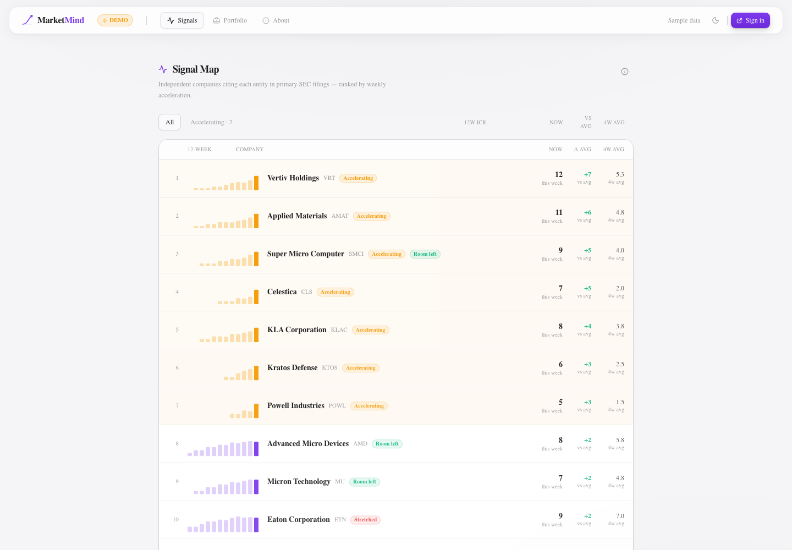
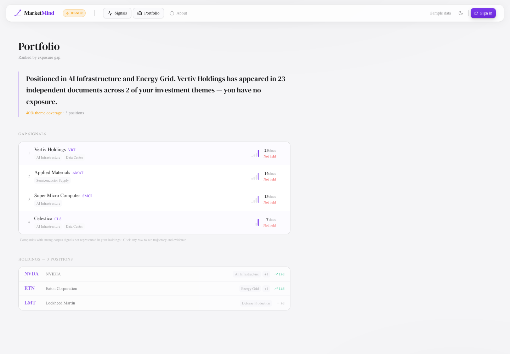
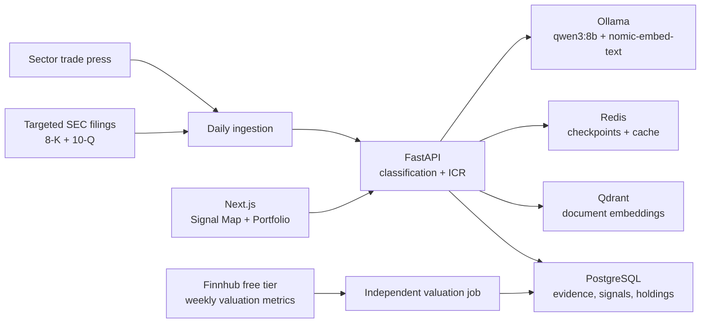

# MarketMind

MarketMind watches the places companies reveal what they depend on, then remembers the pattern long enough for it to become legible. Every day it reads a focused set of SEC filings, tracks which independent companies cite the same entity, and makes the resulting trajectory inspectable.

**[Open the interactive demo →](https://market-mind-ai-pied.vercel.app/demo)**



<br>

## The problem

The useful part of an investment signal is often not contained in one document. A supplier can be named once in an 8-K and it means almost nothing. The same supplier named in filings from several unrelated companies, then named more often next month, is a different kind of fact. It suggests that the company is becoming structurally important to a part of the market.

Search is not built to keep that history. A terminal can find a filing after the fact. An LLM can summarize a document placed in front of it. Neither naturally retains a record of *who kept citing whom*, measures the change week over week, and lets that record compound.

MarketMind was built for the accumulation.

<br>

## How it works, from the outside

Open the Signal Map. The 12-week bars are the product: each one shows how many structurally independent companies cited an entity in primary SEC disclosures that week. Companies whose current citation rate has materially inflected over their own four-week baseline rise to the top.

Open a company to see the evidence trail behind the trajectory—source excerpts, filing dates, thesis exposure, and the corpus activity that produced it. Add holdings to the portfolio view and MarketMind surfaces the evidence-backed companies present in its corpus but absent from the portfolio. It does not tell anyone what to buy or sell.

The public demo uses static sample data and works without an account. It is deliberately shaped like the live product: Signal Map first, company evidence on demand, portfolio gaps second.



<br>

## The metric: Independent Citation Rate

ICR is not a mention count.

For an entity in a given week, MarketMind counts the distinct companies whose targeted 8-K or 10-Q referenced that entity. Nine mentions in one filing remain one citation. Nine different filing companies are nine independent citations.

That distinction is the whole point. A trajectory such as `0 → 2 → 9` is not a claim about price; it is a measurable record of growing, independent corroboration. To keep ordinary name-drops from inflating the measure, targeted filings have to contain supply-chain or capacity-constraint language before their company signals can contribute to ICR.

MarketMind marks a trajectory as **Accelerating** only when the current week is at least twice its prior four-week ICR average and has at least three independent citations. The baseline belongs to the company, rather than to a static global threshold.

<br>

## Why it is not a stock screener

The interface is intentionally narrow. MarketMind is a research memory system, not a recommendation engine, trading terminal, price charting product, or sentiment feed.

It keeps two questions separate:

- **Structural momentum** — Are independent companies increasingly citing this entity in primary disclosures?
- **Valuation context** — Is there still apparent room relative to growth and the 52-week range, or is the story already priced in?

The valuation label is a separate, deliberately small lens. It is computed from a weekly forward PEG snapshot and price relative to the 52-week high, and it is never blended into an “opportunity score.” A green-looking structural signal that is already stretched is not the same thing as an unpriced signal; combining them would hide exactly the distinction the product exists to surface.

<br>

---

<br>

*Everything below this line is about how MarketMind is built. The [stack](#built-with) and [local setup](#running-it-locally) are further down if that is what brought you here.*

<br>

## Under the hood



**The corpus has a quality boundary.**
MarketMind does not ingest the generic EDGAR firehose and hope ranking solves the noise later. It follows a curated, currently 67-ticker universe across AI infrastructure, semiconductor supply chains, energy grid modernization, defense production, and data-center physical infrastructure. The only secondary sources are three sector publications: Breaking Defense, Utility Dive, and EE Times. The core ICR calculation uses primary disclosures only.

**A citation has to earn its place.**
The ingestion worker stores and embeds every collected document, but a primary filing creates company signals only when it passes a constraint-language gate. The product is looking for evidence of capacity, backlog, allocation, lead-time, procurement, or similar operational pressure—not a passing reference to a familiar company.

**The system survives a missed morning.**
Documents use deterministic UUIDs, so re-ingestion is safe. Redis checkpoints each connector as it finishes; a restart does not repeat completed work. On startup, the scheduler checks whether that day's run happened and catches up if it did not.

**Evidence does not rewrite itself.**
Historical evidence is immutable. Changing a thesis's keywords never silently recalculates old records; re-evaluation is explicit. That preserves the meaning of a trajectory over time rather than making its past drift with today’s vocabulary.

**Local inference is the default.**
The core corpus, databases, interface, embeddings, and LLM classification run on infrastructure the user controls. The optional valuation ingestion job makes a small weekly request to Finnhub’s free metrics endpoint; it is isolated from the document and ICR pipeline and can fail independently without affecting it.

<br>

## Built with

| | |
|---|---|
| **Frontend** | Next.js 15 (App Router), React 19, Tailwind CSS, Framer Motion |
| **Backend** | FastAPI, async Python 3.12, SQLAlchemy |
| **Primary data** | Targeted SEC EDGAR filings and curated sector RSS |
| **Database** | PostgreSQL for evidence, signals, holdings, and valuation snapshots |
| **Vector search** | Qdrant with `nomic-embed-text` embeddings |
| **AI** | Ollama with `qwen3:8b` for local classification and synthesis |
| **Caching and resilience** | Redis for feed cache and per-connector ingestion checkpoints |
| **Infrastructure** | Docker Compose |
| **Optional valuation source** | Finnhub free tier for weekly PEG and 52-week-range context |

<br>

## Running it locally

<details>
<summary><strong>Setup instructions</strong></summary>

<br>

Requires Docker with Docker Compose and an Ollama instance that can run `qwen3:8b` and `nomic-embed-text`. Ollama can be local or reachable on another machine.

```bash
git clone https://github.com/karansidhu3/MarketMind-AI.git
cd MarketMind-AI/marketmind

# Pull models when Ollama is running locally.
ollama pull qwen3:8b
ollama pull nomic-embed-text

# Configure MarketMind.
cp .env.example .env
# Set OLLAMA_URL if Ollama runs on another machine.
# Replace JWT_SECRET and the default admin credentials before regular use.

cd infrastructure
docker compose up -d
```

The first startup seeds the five initial investment themes and the scheduler performs a catch-up document ingestion when no run is recorded for the current day.

- App: <http://localhost:3001>
- API documentation (development): <http://localhost:8000/docs>
- Public demo: <http://localhost:3001/demo>

The development defaults are `admin@marketmind.local` / `marketmind`. Change them with `ADMIN_EMAIL` and `ADMIN_PASSWORD` in `.env`.

To collect documents or refresh valuation context manually:

```bash
# From marketmind/infrastructure
docker compose exec backend python scripts/ingest.py

# Optional: requires FINNHUB_API_KEY in .env
docker compose exec backend python scripts/ingest_valuation.py
```

</details>

<br>

---

<br>

MarketMind is a tool for noticing the difference between a mention and a pattern. Its standard is simple: after enough time has passed, can the corpus show something a one-off query could not?
